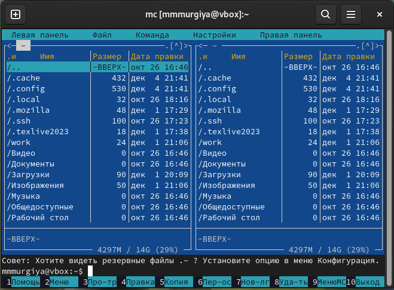
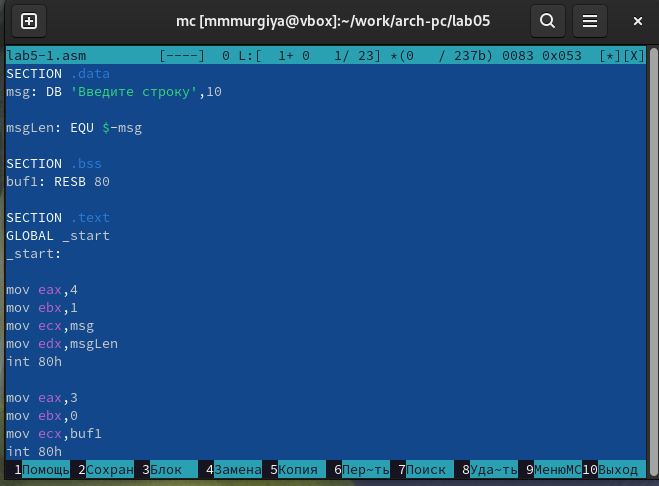

---
## Front matter
title: "Отчёт по лабораторной работе №5"
subtitle: "Дисциплина: Архитектура компьютеров"
author: "Мургия Марк Максимович"

## Generic otions
lang: ru-RU
toc-title: "Содержание"

## Bibliography
bibliography: bib/cite.bib
csl: pandoc/csl/gost-r-7-0-5-2008-numeric.csl

## Pdf output format
toc: true # Table of contents
toc-depth: 2
lof: true # List of figures
lot: true # List of tables
fontsize: 12pt
linestretch: 1.5
papersize: a4
documentclass: scrreprt
## I18n polyglossia
polyglossia-lang:
  name: russian
  options:
	- spelling=modern
	- babelshorthands=true
polyglossia-otherlangs:
  name: english
## I18n babel
babel-lang: russian
babel-otherlangs: english
## Fonts
mainfont: IBM Plex Serif
romanfont: IBM Plex Serif
sansfont: IBM Plex Sans
monofont: IBM Plex Mono
mathfont: STIX Two Math
mainfontoptions: Ligatures=Common,Ligatures=TeX,Scale=0.94
romanfontoptions: Ligatures=Common,Ligatures=TeX,Scale=0.94
sansfontoptions: Ligatures=Common,Ligatures=TeX,Scale=MatchLowercase,Scale=0.94
monofontoptions: Scale=MatchLowercase,Scale=0.94,FakeStretch=0.9
mathfontoptions:
## Biblatex
biblatex: true
biblio-style: "gost-numeric"
biblatexoptions:
  - parentracker=true
  - backend=biber
  - hyperref=auto
  - language=auto
  - autolang=other*
  - citestyle=gost-numeric
## Pandoc-crossref LaTeX customization
figureTitle: "Рис."
tableTitle: "Таблица"
listingTitle: "Листинг"
lofTitle: "Список иллюстраций"
lotTitle: "Список таблиц"
lolTitle: "Листинги"
## Misc options
indent: true
header-includes:
  - \usepackage{indentfirst}
  - \usepackage{float} # keep figures where there are in the text
  - \floatplacement{figure}{H} # keep figures where there are in the text
---

# Цель работы

Приобретение практических навыков работы в Midnight Commander. 
Освоение инструкции языка ассемблера mov и int.

# Задание

1. Использовать Midnight Commander для работы
2. Создать некоторые ассемблерские файлы

# Теоретическое введение

В табл. [-@tbl:std-dir] приведены функциональные клавиши программы.

: Функциональные клавиши Midnight Commander {#tbl:std-dir}

| Функциональные клавишы | Выполняемое действие                                                                                                                    |
|------------------------|-----------------------------------------------------------------------------------------------------------------------------------------|
| `F1`                   | Вызов контекстно-зависимой подсказки                                                                                                    |
| `F2`                   | Вызов меню, созданного пользователем                                                                                                    |
| `F3`                   | Просмотр файла, на который указывает подсветка в активной панели                                                                        |
| `F4`                   | Вызов встроенного редактора для файла, на которой указывает подсветка в активной панели                                                 |
| `F5`                   | Копирование файла или группы отмеченных файлов из каталога, отображаемого в активной панели, в каталог, отображаемый на второй панели   |
| `F6`                   | Перенос файла или группы отмеченных файлов из каталога, отображаемого в активной панели, в каталог, отображаемый на второй панели       |
| `F7`                   | Создание подкаталога в каталоге, отображаемом в активной панели                                                                         |
| `F8`                   | Удаление файла, подкаталога или группы отмеченных файлов                                                                                |
| `F9`                   | Вызов основного меню программы                                                                                                          |
| `F10`                  | Выход из программы                                                                                                                      |

# Выполнение лабораторной работы

После того, как Midnight Commander загружен, его можно открыть вписав mc. Вид файлого менеджера показан в фотографии (рис. [-@fig:001]).

{#fig:001 width=70%}

Далее нужно написать ассемблерский файл, который будет принимать текст.

{#fig:002 width=70%}

{#fig:003 width=70%}

# Выводы

Мы приобрели практические навыки работы в Midnight Commander и освоили инструкции языка ассемблера mov и int.

# Список литературы{.unnumbered}

::: {#refs}
:::
