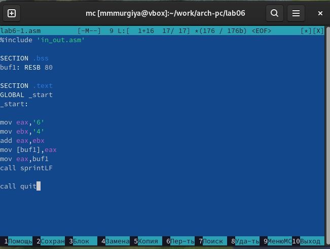
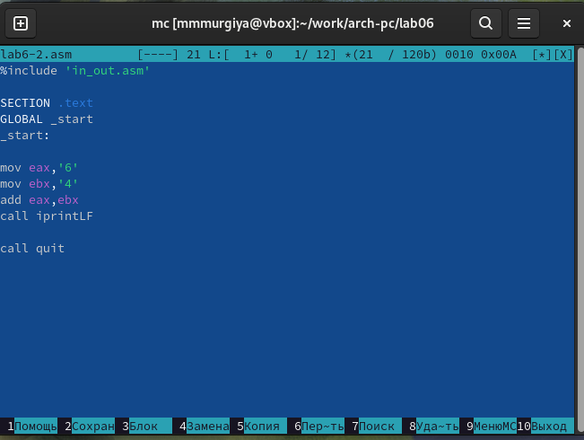
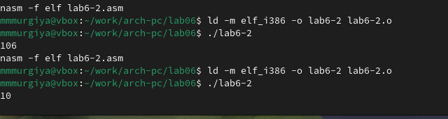
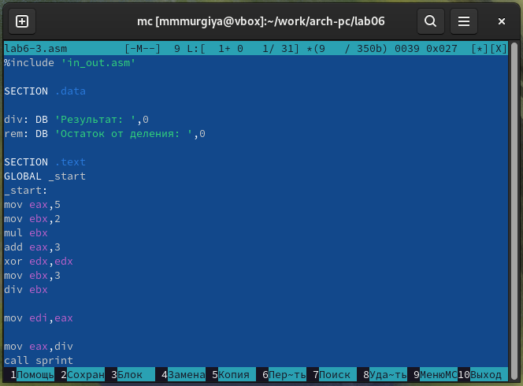
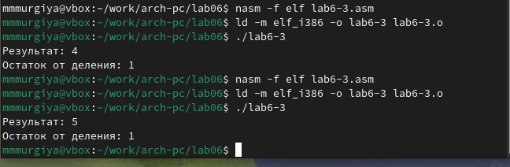
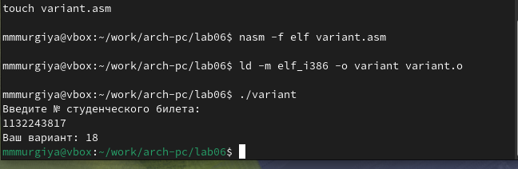

---
## Front matter
title: "Отчёт по лабораторной работе №6"
subtitle: "Дисциплина: Архитектура Компьютеров"
author: "Мургия Марк Максимович"

## Generic otions
lang: ru-RU
toc-title: "Содержание"

## Bibliography
bibliography: bib/cite.bib
csl: pandoc/csl/gost-r-7-0-5-2008-numeric.csl

## Pdf output format
toc: true # Table of contents
toc-depth: 2
lof: true # List of figures
lot: true # List of tables
fontsize: 12pt
linestretch: 1.5
papersize: a4
documentclass: scrreprt
## I18n polyglossia
polyglossia-lang:
  name: russian
  options:
	- spelling=modern
	- babelshorthands=true
polyglossia-otherlangs:
  name: english
## I18n babel
babel-lang: russian
babel-otherlangs: english
## Fonts
mainfont: IBM Plex Serif
romanfont: IBM Plex Serif
sansfont: IBM Plex Sans
monofont: IBM Plex Mono
mathfont: STIX Two Math
mainfontoptions: Ligatures=Common,Ligatures=TeX,Scale=0.94
romanfontoptions: Ligatures=Common,Ligatures=TeX,Scale=0.94
sansfontoptions: Ligatures=Common,Ligatures=TeX,Scale=MatchLowercase,Scale=0.94
monofontoptions: Scale=MatchLowercase,Scale=0.94,FakeStretch=0.9
mathfontoptions:
## Biblatex
biblatex: true
biblio-style: "gost-numeric"
biblatexoptions:
  - parentracker=true
  - backend=biber
  - hyperref=auto
  - language=auto
  - autolang=other*
  - citestyle=gost-numeric
## Pandoc-crossref LaTeX customization
figureTitle: "Рис."
tableTitle: "Таблица"
listingTitle: "Листинг"
lofTitle: "Список иллюстраций"
lotTitle: "Список таблиц"
lolTitle: "Листинги"
## Misc options
indent: true
header-includes:
  - \usepackage{indentfirst}
  - \usepackage{float} # keep figures where there are in the text
  - \floatplacement{figure}{H} # keep figures where there are in the text
---

# Цель работы

Освоение арифметических инструкций языка ассемблера NASM.

# Задание

1. Понять работу арифметических операций
2. Использовать из на практике, создавая ассемблерские программы

# Теоретическое введение

В табл. [-@tbl:std-dir] приведены все операции, которыми пользовался я в данной лабораторной работе.

: Арифметические операции в NASM {#tbl:std-dir}

| Имя операции | Описание операции       |
|--------------|-------------------------|
| `add`        | Целочисленное сложение  |
| `sub`        | Целочисленное вычитание |
| `inc`        | Прибавление единицы     |
| `dec`        | Вычитание единицы       |
| `neg`        | Изменение знака         |
| `mul`        | Беззнаковое умножение   |
| `imul`       | Знаковое умножение      |
| `div`        | Беззнаковое деление     |
| `idiv`       | Знаковое деление        |

# Выполнение лабораторной работы

Как говорится в инструкции по лабораторной работе №6, нужно создать несколько файлов, показывающих виды вывода результатов. В первом варианте выводится символ ASCII, так как мы сложили индексы цифр 6 и 4.

{#fig:001 width=70%}

Во втором мы получаем сам индекс. Если поминять '6' и '4' на 6 и 4, то мы получим сумму этих чисел.

{#fig:002 width=70%}

{#fig:003 width=70%}

На фотографий ниже показывают арифметические выражения.

{#fig:004 width=70%}

{#fig:005 width=70%}

Для последней задачи, я отвечу на вопросы связанные с lab6-4.asm.

{#fig:006 width=70%}

1. Данные строки отвечают за вывод на экран сообщения 'Ваш вариант: ':

mov eax,rem  
call sprint

2. Инструкция используется для ввода номера студенческого билета.
3. Переделывает данные нашего ввода в число, которое мы можем понять.
4. Ниже даны строки, подходящие к вопросу:

xor edx,edx  
mov ebx,20  
div ebx  
inc edx

5. eax.
6. Добавляет единицу к регистру edx.
7. Вывод появляется следующами строками:

mov eax,edx  
call iprintLF

# Выводы

Мы освоили арифметические инструкции языка ассемблера NASM.

# Список литературы{.unnumbered}

::: {#refs}
:::
