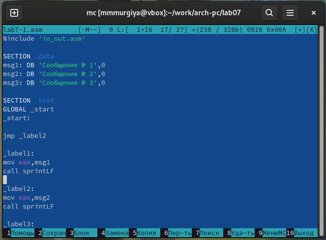
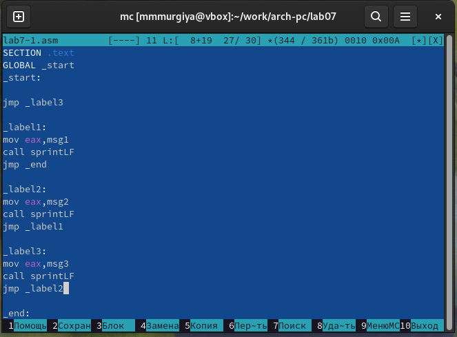
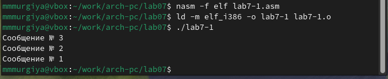
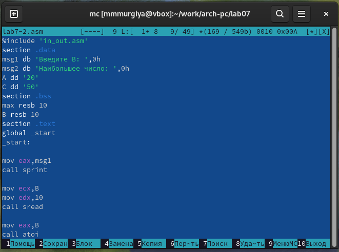
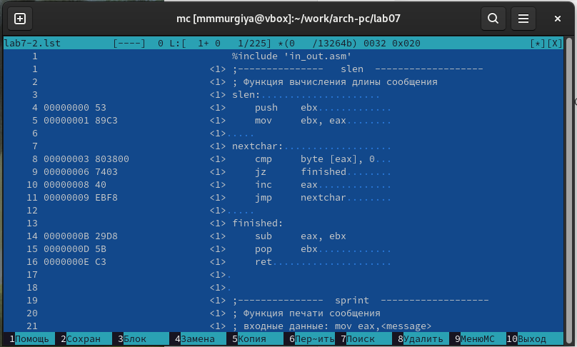

---
## Front matter
title: "Отчёта по лабораторной работе №7"
subtitle: "Дисциплина: Архитектура Компьютеров"
author: "Мургия Марк Максимович"

## Generic otions
lang: ru-RU
toc-title: "Содержание"

## Bibliography
bibliography: bib/cite.bib
csl: pandoc/csl/gost-r-7-0-5-2008-numeric.csl

## Pdf output format
toc: true # Table of contents
toc-depth: 2
lof: true # List of figures
lot: true # List of tables
fontsize: 12pt
linestretch: 1.5
papersize: a4
documentclass: scrreprt
## I18n polyglossia
polyglossia-lang:
  name: russian
  options:
	- spelling=modern
	- babelshorthands=true
polyglossia-otherlangs:
  name: english
## I18n babel
babel-lang: russian
babel-otherlangs: english
## Fonts
mainfont: IBM Plex Serif
romanfont: IBM Plex Serif
sansfont: IBM Plex Sans
monofont: IBM Plex Mono
mathfont: STIX Two Math
mainfontoptions: Ligatures=Common,Ligatures=TeX,Scale=0.94
romanfontoptions: Ligatures=Common,Ligatures=TeX,Scale=0.94
sansfontoptions: Ligatures=Common,Ligatures=TeX,Scale=MatchLowercase,Scale=0.94
monofontoptions: Scale=MatchLowercase,Scale=0.94,FakeStretch=0.9
mathfontoptions:
## Biblatex
biblatex: true
biblio-style: "gost-numeric"
biblatexoptions:
  - parentracker=true
  - backend=biber
  - hyperref=auto
  - language=auto
  - autolang=other*
  - citestyle=gost-numeric
## Pandoc-crossref LaTeX customization
figureTitle: "Рис."
tableTitle: "Таблица"
listingTitle: "Листинг"
lofTitle: "Список иллюстраций"
lotTitle: "Список таблиц"
lolTitle: "Листинги"
## Misc options
indent: true
header-includes:
  - \usepackage{indentfirst}
  - \usepackage{float} # keep figures where there are in the text
  - \floatplacement{figure}{H} # keep figures where there are in the text
---

# Цель работы

Изучение команд условного и безусловного переходов. Приобретение навыков написания программ с использованием переходов. Знакомство с назначением и структурой файла листинга.

# Задание

1. Использовать функцию команд перехода
2. Понять структуру файла листинга

# Теоретическое введение

Я уже начинаю терять идей того, что вставлять в теоретическое введение.

: Регистр флагов {#tbl:std-dir}

| Бит | Обозначение | Название             |
|-----|-------------|----------------------|
| 0   | `CF`        | Carry Flag           |
| 2   | `PF`        | Parity Flag          |
| 4   | `AF`        | Auxiliary Carry Flag |
| 6   | `ZF`        | Zero Flag            |
| 7   | `SF`        | Sign Flag            |
| 11  | `OF`        | Overflow Flag        |

# Выполнение лабораторной работы

Используя команды перехода можно пропускать команды (рис. [-@fig:001]) или даже делать их в другом порядке (рис. [-@fig:002]).

{#fig:001 width=70%}

{#fig:002 width=70%}

{#fig:003 width=70%}

С помощью NASM нужно сделать листинг следующего файла. В листинге показывают все команды файла 'in_out.asm', когда и как они используются в данном файле.

{#fig:004 width=70%}

{#fig:005 width=70%}

# Выводы

Мы изучили команды условного и безусловного переходов, приобрели навыки написания программ с использованием переходов и познакомились с назначением и структурой файла листинга.

# Список литературы{.unnumbered}

::: {#refs}
:::
