---
## Front matter
title: "Отчёт по лабораторной работе №8"
subtitle: "Дисциплина: Архитектура Компьютеров"
author: "Мургия Марк Максимович"

## Generic otions
lang: ru-RU
toc-title: "Содержание"

## Bibliography
bibliography: bib/cite.bib
csl: pandoc/csl/gost-r-7-0-5-2008-numeric.csl

## Pdf output format
toc: true # Table of contents
toc-depth: 2
lof: true # List of figures
lot: true # List of tables
fontsize: 12pt
linestretch: 1.5
papersize: a4
documentclass: scrreprt
## I18n polyglossia
polyglossia-lang:
  name: russian
  options:
	- spelling=modern
	- babelshorthands=true
polyglossia-otherlangs:
  name: english
## I18n babel
babel-lang: russian
babel-otherlangs: english
## Fonts
mainfont: IBM Plex Serif
romanfont: IBM Plex Serif
sansfont: IBM Plex Sans
monofont: IBM Plex Mono
mathfont: STIX Two Math
mainfontoptions: Ligatures=Common,Ligatures=TeX,Scale=0.94
romanfontoptions: Ligatures=Common,Ligatures=TeX,Scale=0.94
sansfontoptions: Ligatures=Common,Ligatures=TeX,Scale=MatchLowercase,Scale=0.94
monofontoptions: Scale=MatchLowercase,Scale=0.94,FakeStretch=0.9
mathfontoptions:
## Biblatex
biblatex: true
biblio-style: "gost-numeric"
biblatexoptions:
  - parentracker=true
  - backend=biber
  - hyperref=auto
  - language=auto
  - autolang=other*
  - citestyle=gost-numeric
## Pandoc-crossref LaTeX customization
figureTitle: "Рис."
tableTitle: "Таблица"
listingTitle: "Листинг"
lofTitle: "Список иллюстраций"
lotTitle: "Список таблиц"
lolTitle: "Листинги"
## Misc options
indent: true
header-includes:
  - \usepackage{indentfirst}
  - \usepackage{float} # keep figures where there are in the text
  - \floatplacement{figure}{H} # keep figures where there are in the text
---

# Цель работы

Приобретение навыков написания программ с использованием циклов и обработки аргументов командной строки.

# Задание

1. Понять работу циклов
2. Использовать обработку аргументов командной строки

# Теоретическое введение

Идей для таблиц больше нет.

push мы используем для вставки в стек значение переменной или регистра, а pop используется для извлечение элемента из стека.
loop заставляет команды в скрипте повторяться несколько раз или при каком-либо условии.

# Выполнение лабораторной работы

Первая версия lab8-1.asm выводит числа от 1 до N. Цикл используется для перехода к следующему числу.

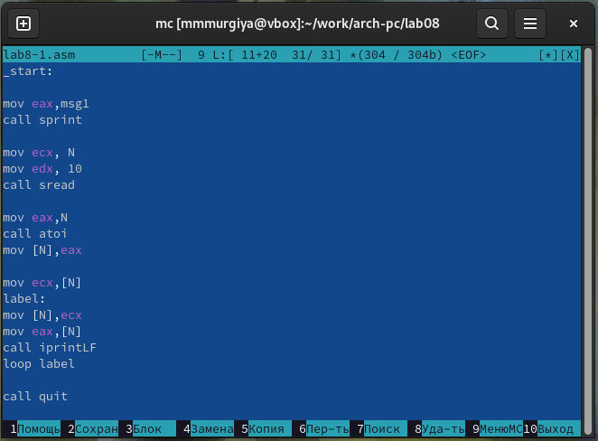{#fig:001 width=70%}

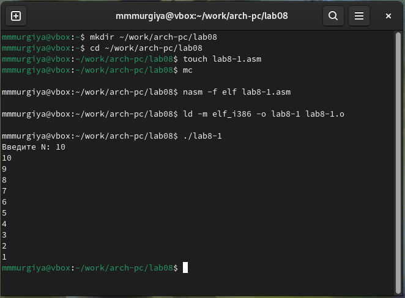{#fig:002 width=70%}

Добавив sub ecx,1, мы получаем четные или не четные числа меньше N.

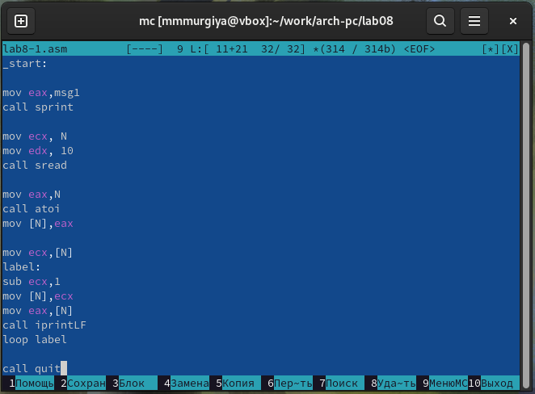{#fig:003 width=70%}

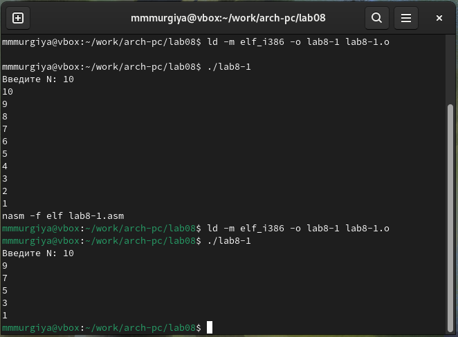{#fig:004 width=70%}

Если добавить функции push и pop, то получится программа, выводящая числа меньше N, начиная с нуля.

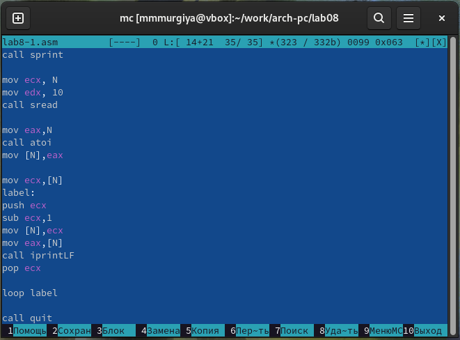{#fig:005 width=70%}

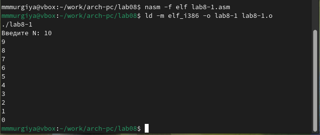{#fig:006 width=70%}

Следующий скрипт не только показывает использование аргументов в командной строке, но также как терминал понимает аргументы разных типов.

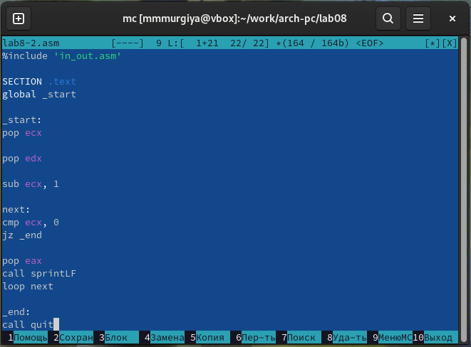{#fig:007 width=70%}

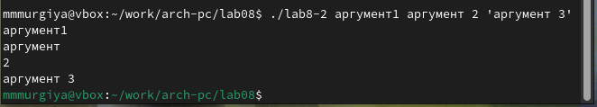{#fig:008 width=70%}

Третий скрипт суммирует все аргументы в командной строке.

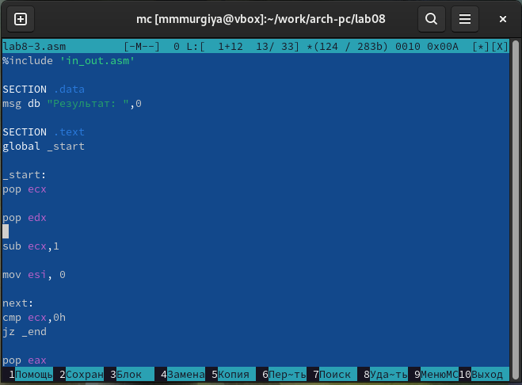{#fig:009 width=70%}

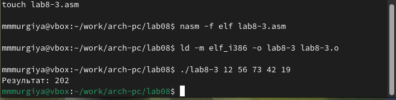{#fig:010 width=70%}

Для Лабораторной работы нужно изменить программу, что умножила все аргументы друг на друга.

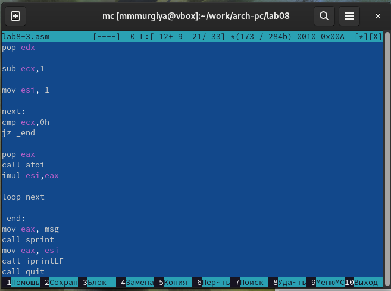{#fig:011 width=70%}

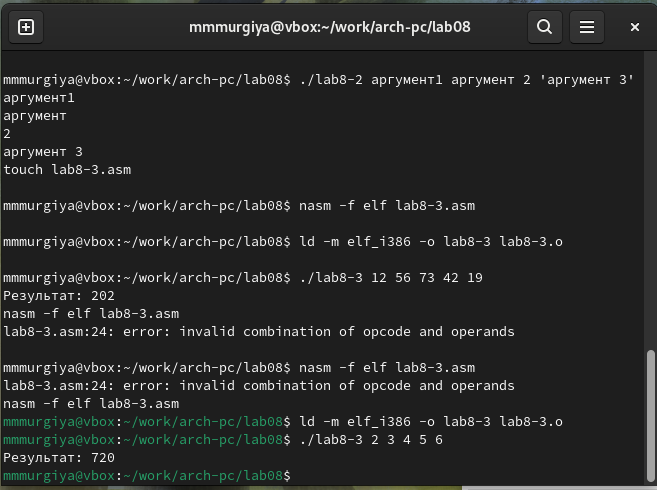{#fig:012 width=70%}

# Выводы

Мы приобрели навыки написания программ с использование циклов и обработки аргументов командной строки.

# Список литературы{.unnumbered}

::: {#refs}
:::
