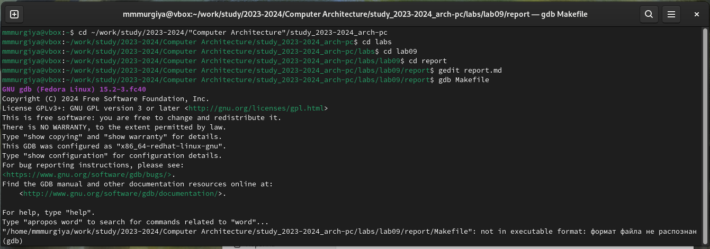

---
## Front matter
title: "Отчёт по лабораторной работе №9"
subtitle: "Дисциплина: Архитектура Компьютеров"
author: "Мургия Марк Максимович"

## Generic otions
lang: ru-RU
toc-title: "Содержание"

## Bibliography
bibliography: bib/cite.bib
csl: pandoc/csl/gost-r-7-0-5-2008-numeric.csl

## Pdf output format
toc: true # Table of contents
toc-depth: 2
lof: true # List of figures
lot: true # List of tables
fontsize: 12pt
linestretch: 1.5
papersize: a4
documentclass: scrreprt
## I18n polyglossia
polyglossia-lang:
  name: russian
  options:
	- spelling=modern
	- babelshorthands=true
polyglossia-otherlangs:
  name: english
## I18n babel
babel-lang: russian
babel-otherlangs: english
## Fonts
mainfont: IBM Plex Serif
romanfont: IBM Plex Serif
sansfont: IBM Plex Sans
monofont: IBM Plex Mono
mathfont: STIX Two Math
mainfontoptions: Ligatures=Common,Ligatures=TeX,Scale=0.94
romanfontoptions: Ligatures=Common,Ligatures=TeX,Scale=0.94
sansfontoptions: Ligatures=Common,Ligatures=TeX,Scale=MatchLowercase,Scale=0.94
monofontoptions: Scale=MatchLowercase,Scale=0.94,FakeStretch=0.9
mathfontoptions:
## Biblatex
biblatex: true
biblio-style: "gost-numeric"
biblatexoptions:
  - parentracker=true
  - backend=biber
  - hyperref=auto
  - language=auto
  - autolang=other*
  - citestyle=gost-numeric
## Pandoc-crossref LaTeX customization
figureTitle: "Рис."
tableTitle: "Таблица"
listingTitle: "Листинг"
lofTitle: "Список иллюстраций"
lotTitle: "Список таблиц"
lolTitle: "Листинги"
## Misc options
indent: true
header-includes:
  - \usepackage{indentfirst}
  - \usepackage{float} # keep figures where there are in the text
  - \floatplacement{figure}{H} # keep figures where there are in the text
---

# Цель работы

Приобретение навыков написания программ с использованием подпрограмм.
Знакомство с методами откладки при помощи GDB и его основными возможностями.

# Задание

1. Написать подпрограмму в ассемблерском файле;
2. Понять как пользоваться GDB.

# Теоретическое введение

[-@tbl:std-dir]

: Формат отображения данных команды x {#tbl:std-dir}

|              | Описание каталога                                                                                                          |
|--------------|----------------------------------------------------------------------------------------------------------------------------|
| `N`          | Определяет, сколько ячеек памяти отобразить.                                                                               |
| `F; s`       | Строка, оканчивающаяся нулем.                                                                                              |
| `F; i`       | Машинная инструкция                                                                                                        |
| `F; x`       | Шестнадцетиричное число                                                                                                    |
| `F; a`       | Адрес                                                                                                                      |
| `U; b`       | Байт                                                                                                                       |
| `U; h`       | Полуслова, 2 байта                                                                                                         |
| `U; w`       | Машинное слово, 4 байта                                                                                                    |
| `U; g`       | Длинное слово, 8 байт                                                                                                      |

# Выполнение лабораторной работы

Используем NASM, чтобы превращать наши скрипты в исполняемые файлы. 
В этом случае, нам нужно сделать скрипт с подпрограммой, который вычисляет выражение 2x+7.
Также мы используем функции отладки GDB с файлом, который выводит 'Hello, world!'. (рис. [-@fig:001]).

{#fig:001 width=70%}

# Выводы

Мы приобрели навыки написания программ с использованием подпрограмм, 
а также познакомились с методами откладки при помощи GDB и его основными возможностями.

# Список литературы{.unnumbered}

::: {#refs}
:::
