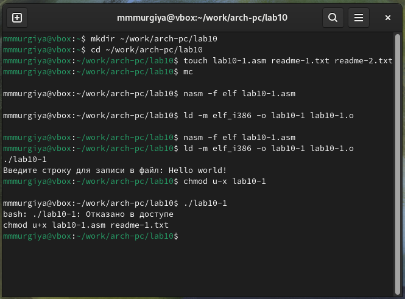

---
## Front matter
title: "Отчёт по лабораторной работе №10"
subtitle: "Дисциплина: Архитектура Компьютером"
author: "Мургия Марк Максимович"

## Generic otions
lang: ru-RU
toc-title: "Содержание"

## Bibliography
bibliography: bib/cite.bib
csl: pandoc/csl/gost-r-7-0-5-2008-numeric.csl

## Pdf output format
toc: true # Table of contents
toc-depth: 2
lof: true # List of figures
lot: true # List of tables
fontsize: 12pt
linestretch: 1.5
papersize: a4
documentclass: scrreprt
## I18n polyglossia
polyglossia-lang:
  name: russian
  options:
	- spelling=modern
	- babelshorthands=true
polyglossia-otherlangs:
  name: english
## I18n babel
babel-lang: russian
babel-otherlangs: english
## Fonts
mainfont: IBM Plex Serif
romanfont: IBM Plex Serif
sansfont: IBM Plex Sans
monofont: IBM Plex Mono
mathfont: STIX Two Math
mainfontoptions: Ligatures=Common,Ligatures=TeX,Scale=0.94
romanfontoptions: Ligatures=Common,Ligatures=TeX,Scale=0.94
sansfontoptions: Ligatures=Common,Ligatures=TeX,Scale=MatchLowercase,Scale=0.94
monofontoptions: Scale=MatchLowercase,Scale=0.94,FakeStretch=0.9
mathfontoptions:
## Biblatex
biblatex: true
biblio-style: "gost-numeric"
biblatexoptions:
  - parentracker=true
  - backend=biber
  - hyperref=auto
  - language=auto
  - autolang=other*
  - citestyle=gost-numeric
## Pandoc-crossref LaTeX customization
figureTitle: "Рис."
tableTitle: "Таблица"
listingTitle: "Листинг"
lofTitle: "Список иллюстраций"
lotTitle: "Список таблиц"
lolTitle: "Листинги"
## Misc options
indent: true
header-includes:
  - \usepackage{indentfirst}
  - \usepackage{float} # keep figures where there are in the text
  - \floatplacement{figure}{H} # keep figures where there are in the text
---

# Цель работы

Приобретение навыков написания программ для работы с файлами.

# Задание

1. Понять работу с chmod.
2. Записывать текст в файлы txt.

# Теоретическое введение

: Возможные значения аргументов команды chmod {#tbl:std-dir}

| Категория        | Обозначение | Значение                                         |
|------------------|-------------|--------------------------------------------------|
| `Принадлежность` | `u`         | Владелец                                         |
|                  | `g`         | Группа владельца                                 |
|                  | `o`         | Прочие пользователи                              |
|                  | `a`         | Все пользователи, то есть "a" эквивалентно "ugo" |
| `Действие`       | `+`         | Добавить набор прав                              |
|                  | `-`         | Отменить набор прав                              |
|                  | `=`         | Назначить набор прав                             |
| `Право`          | `r`         | Право на чтение                                  |
|                  | `w`         | Право на запись                                  |
|                  | `x`         | Право на исполнение                              |
# Выполнение лабораторной работы

В ассемблерском файле мы пишем программу, которая будет вписывать текст. Использую chmod, мы можем изменить права на исполнение файлов. 

{#fig:001 width=70%}

{#fig:002 width=70%}

{#fig:003 width=70%}

{#fig:004 width=70%}

{#fig:005 width=70%}

{#fig:006 width=70%}

{#fig:007 width=70%}

# Выводы

Мы приобрели навыки написания программ для работы с файлами.

# Список литературы{.unnumbered}

::: {#refs}
:::
